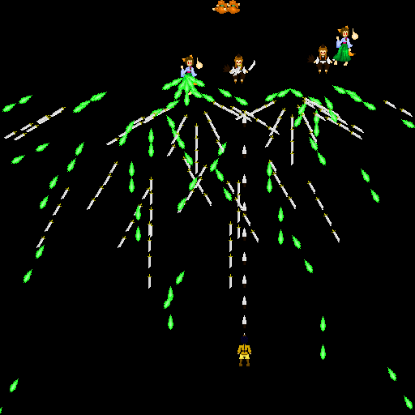

<h1>This is an environment for training a Reinforcement Learning agent on the game <a href="https://www.pygame.org/project/937">Sacred Curry Shooter</a>, a top-down shooter inspired by Team Shanghai Alice' Touhou Project.</h1>

<h1>Requirements: (Python 3x)</h1>
<ul>
  <li>
    Numpy
  </li>
  <li>
    Pygame
  </li>
  <li>
    Scikit-image
  </li>
  <li>
    Tensorflow
  </li>
  <li>
    Keras
  </li>
  <li>
    h5py
  </li>
</ul>

<h1>General Information/Notes</h1>
<h2>Environment and Game</h2>

  I've made a lot of edits to the original game to set it up for automated learning. I tried to write some documentation on the original game, but I have probably left out a lot of information. I've also tried to fix a lot of the bugs that were present in the base game, and I <strong>THINK</strong> I was successful. We'll see about that.
   
  I set up the game/environment so that random types of monsters (there are only 3 in the game) spawn at the top of the screen in somewhat random locations on the x axis every certain amount of seconds. The game/level will restart when the agent dies. Reward signals that are currently being tracked include hitting enemies, living in the environment, and dying.

<h2>Learning</h2>

  Learning is done in the <strong>train.py</strong> file, along with the settings for it in <strong>config.py</strong>. At this point I still haven't found the best settings for the agent to learn. In most of my attempts it either runs to the sides of the screen o avoid death, or it just sits in the middle anticipating enemy spawns but does not dodge any projectiles.

<h1>File Information</h1>
<h2>config.py</h2>

This file (should) contain all of the variables you would want to change to customize how your agent learns (except for the network). As of writing this, it contains variables including:
  <ul>
    <li>
      num_of_cols - number of columns for screenshot resizing
    </li>
    <li>
      num_of_rows - number of rows for screenshot resizing
    </li>
    <li>  
      num_of_hidden_layer_neurons - number of neurons in the fully connected layer before the output layer
    </li>
    <li>    
      img_channels - channels of image
    </li>
    <li>  
      num_of_actions
    </li>
    <li>  
      batch_size - batch size in experience replay deque to update
    </li>
    <li>  
      epsilon
    </li>
    <li>  
      observe - amount of timesteps to observe until actually training the agent
    </li>
    <li>  
      gamma
    </li>
    <li>  
      action_array - array of strings containing the actions the agent can do
    </li>
    <li>  
      reward_on_hit - reward given to the agent for hitting an enemy
    </li>
    <li>  
      reward_in_env - reward given to the agent for remaining alive in the environment
    </li>
    <li>  
      death_reward - reward given to the agent when it dies
    </li>
    <li>  
      timesteps_to_save_weights - timesteps until the weights of the model are saved to a file
    </li>
    <li>  
      exp_replay_memory - length of the experience replay deque until it starts popping information from it
    </li>
  </ul>

<h2>train.py</h2>

  Contains all the information for training the agent, including the architecture of the network.

<h2>main.py</h2>

  Main file that contains code needed to run the game. Changed a ton and wrapped it into train.py to set it up for automated learning.

<h2>levels.py</h2>

  Defines how the levels are set up and where/which/when monsters spawn on the level. For the environment I chose to modify level 1 so that the agent only spawns on this level, and monsters will spawn every set amount of seconds for a certain amount of time.
   If you want to change where/when/which monsters spawn on this level, use this file.

<h2>sprites.py</h2>

  Information about things like sprites, hitboxes, controls for the player, monsters and bullets.

<h2>gameplay.py</h2>

  Runs the game normally for a real person (you) to play what the agent would play through. Good for testing changes to the actual game/environment.

<h2>screenshotter.py</h2>

  Creates and saves screenshots of the images that would be sent into the network.

<h2>Check out these other influential projects!</h2>

<a href="https://github.com/yanpanlau/Keras-FlappyBird">Flappy Bird environment with Keras</a> 
<a href="http://karpathy.github.io/2016/05/31/rl/">Deep Reinforcement Learning: Pong from Pixels</a> 
<a href="https://keon.io/deep-q-learning/">Deep Q-Learning with Keras and Gym</a>

